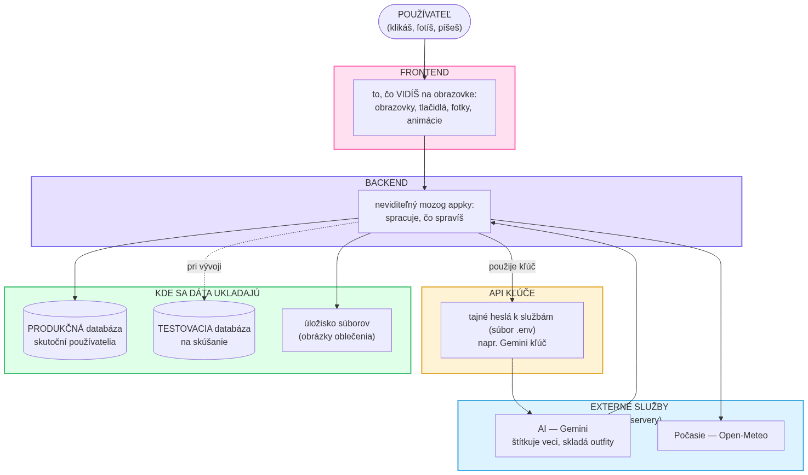
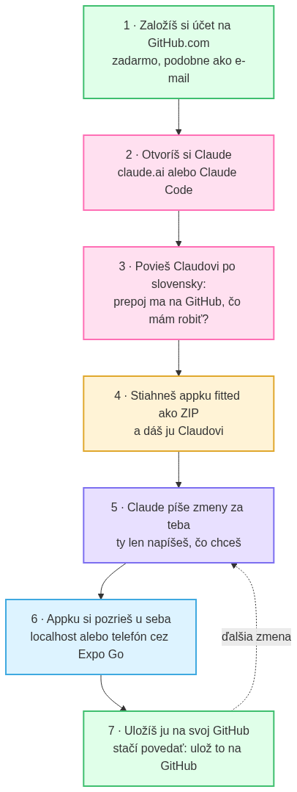

# Príručka pre úplného začiatočníka 🌱

Ahoj! Tento návod je pre teba, **aj keď si nikdy nič neprogramoval(a)**. Prevedie ťa od úplnej nuly: čo znamenajú tie čudné slová (frontend, backend, databáza, API kľúč…), ako si založiť účet na GitHube, ako používať **Claude** (AI, ktorá ti píše appku), a ako sa appka **fitted** dostane k tebe, aby si si ju mohol(la) pozrieť a meniť.

Čítaj pokojne pomaly. Nemusíš všetkému hneď rozumieť — dôležité je, že keď budeš niečo potrebovať, **stačí sa opýtať Claude po slovensky** a on ti pomôže.

> 💡 **Zlaté pravidlo:** nič nepokazíš natrvalo. Všetko sa dá vrátiť späť. Pokojne skúšaj.

---

## Obsah

1. [Slovníček: čo znamenajú tie slová](#1-slovníček-čo-znamenajú-tie-slová)
2. [Ako to celé do seba zapadá (obrázok)](#2-ako-to-celé-do-seba-zapadá)
3. [Krok za krokom: od nuly po appku](#3-krok-za-krokom-od-nuly-po-appku)
4. [Databázy: produkčná vs testovacia + Supabase](#4-databázy-produkčná-vs-testovacia--supabase)
5. [Ako si appku pozrieš u seba (localhost)](#5-ako-si-appku-pozrieš-u-seba-localhost)
6. [Čo je Claude a ako sa s ním rozprávať](#6-čo-je-claude-a-ako-sa-s-ním-rozprávať)
7. [Keď sa zasekneš](#7-keď-sa-zasekneš)

---

## 1. Slovníček: čo znamenajú tie slová

Predstav si appku ako reštauráciu 🍽️:

| Slovo | Čo to je (po ľudsky) | Príklad z reštaurácie |
|---|---|---|
| **Frontend** | To, čo **vidíš a klikáš** — obrazovky, tlačidlá, fotky, farby. | Jedáleň, menu, stôl — to, čo vidí hosť. |
| **Backend** | Neviditeľný **mozog** na pozadí. Spracuje, čo spravíš (napr. „vyskladaj mi outfit"). | Kuchyňa — hosť ju nevidí, ale práca sa deje tam. |
| **Databáza** | Kde sú **uložené dáta** (tvoje oblečenie, outfity, profil). | Sklad a chladnička s ingredienciami. |
| **API kľúč** | **Tajné heslo**, ktorým sa appka prihlási k cudzej službe (napr. k AI). Uložené v súbore `.env`. | Tvoja platobná karta — bez nej ti dodávateľ nič nedá. |
| **Externá služba** | Cudzí server, ktorý niečo spraví za teba (napr. **Gemini** = AI, **Open-Meteo** = počasie). | Dodávateľ, ktorý ti vozí mäso a zeleninu. |
| **Úložisko súborov** | Kde sú uložené **obrázky a súbory** (fotky oblečenia). | Mraznička na veľké veci. |
| **localhost** | Appka, ktorá beží **len u teba na počítači/telefóne**. Nikto iný ju nevidí, môžeš pokojne skúšať. | Skúšobná kuchyňa doma. |
| **GitHub** | **Internetový sklad na kód.** Ako Google Drive, ale pre programy. Tu žije celá appka a ukladajú sa všetky verzie. | Trezor s receptami, kde sa pamätá každá zmena. |
| **Claude** | **AI asistent, ktorý ti píše kód.** Ty mu po slovensky povieš, čo chceš, on to spraví. | Šéfkuchár, ktorý uvarí čokoľvek, čo si objednáš. |
| **Skilly (skills)** | Mini-návody, ktoré Claude vie načítať, aby bol **lepší v konkrétnej veci** (dizajn, testovanie…). | Špecializované kuchárky pre kuchára. |
| **Lovable** | Iný nástroj na stavanie appiek „popísaním" (napíšeš, čo chceš → spraví web). Fitted je robená cez **Claude**, nie Lovable — ale dobré vedieť, že existuje. | Iná reštaurácia s iným kuchárom. |

> ℹ️ **Skilly pre teba:** pre appku fitted **nepotrebuješ žiadne špeciálne skilly**. Stačí Claude a súbory `AGENTS.md` a `CLAUDE.md`, ktoré sú už v appke — tie Claudovi automaticky vysvetlia celý projekt. Keď budeš chcieť, opýtaj sa ho: *„aké skilly by mi pomohli s týmto?"*

---

## 2. Ako to celé do seba zapadá

Takto vyzerá appka znútra — čo je frontend, backend, kde sú kľúče a kde sa ukladajú dáta:



**Ako to čítať:** klikneš v appke (frontend) → mozog appky (backend) to spracuje → ak treba AI, použije **tajný kľúč** a opýta sa Gemini → výsledok sa **uloží** (databáza + obrázky) → a zobrazí sa ti späť na obrazovke.

> 📱 **Dôležité o fitted:** appka fitted je zatiaľ jednoduchá — **frontend, backend aj databáza sú všetky priamo v telefóne** (nič nebeží na cudzom serveri). Jediné, čo ide „von", je AI (Gemini) a počasie. Skutočnú databázu na serveri (Supabase) pridáš až vtedy, keď budeš chcieť, aby dáta boli aj na webe a na viacerých zariadeniach — viac v [kapitole 4](#4-databázy-produkčná-vs-testovacia--supabase).

---

## 3. Krok za krokom: od nuly po appku



### Krok 1 — Založ si účet na GitHube
1. Choď na **https://github.com**
2. Klikni **Sign up** (Registrovať sa)
3. Zadaj **e-mail**, vymysli **heslo** a **používateľské meno** (napr. `tvojemeno`)
4. Potvrď e-mail (príde ti overovací odkaz)

Hotovo — toto je miesto, kde bude bývať tvoja appka. Je to **zadarmo**.

### Krok 2 — Otvor si Claude
Máš dve možnosti, obe sú dobré:
- **claude.ai** — vo webovom prehliadači (najjednoduchšie na začiatok), alebo
- **Claude Code** — appka/nástroj priamo na tvojom počítači (lepšie na reálne programovanie).

Claude je ten, kto ti bude **písať kód za teba**. Ty mu len po slovensky napíšeš, čo chceš.

### Krok 3 — Prepoj Claude s GitHubom
Nemusíš to vedieť technicky. **Len napíš Claudovi po slovensky:**

> *„Prepoj ma na GitHub, čo mám robiť?"*

Claude ťa **krok za krokom prevedie** (prihlásenie, povolenia…). Keď budú prepojení, Claude vie čítať aj ukladať tvoj kód na GitHub.

### Krok 4 — Stiahni appku fitted a daj ju Claudovi
Appku fitted máš ako **ZIP súbor** (priložený k tomuto návodu). 
- Rozbaľ ZIP do priečinka.
- Otvor tento priečinok v Claude Code (alebo nahraj/„hoď" ZIP do Claude).
- Povedz mu: *„Toto je moja appka, chcem v nej pokračovať."*

Claude si automaticky prečíta súbory `AGENTS.md` a `CLAUDE.md` a bude vedieť, **o čom appka je a ako funguje** — bez toho, aby si mu to musel(a) vysvetľovať.

> 🔑 **Pozor — kľúč k AI:** aby fungovala AI časť, treba **Gemini kľúč**. Získaš ho zadarmo na **https://aistudio.google.com/apikey**. Potom povedz Claudovi: *„Pomôž mi vložiť Gemini kľúč do súboru `.env`."* On ťa prevedie. (Tento kľúč je súkromný a nikdy sa nenahrá na GitHub.)

### Krok 5 — Rob zmeny cez Claude
Teraz už len **píšeš po slovensky, čo chceš**, napríklad:
- *„Zmeň hlavnú farbu appky na zelenú."*
- *„Pridaj tlačidlo na zdieľanie outfitu."*
- *„Prečo mi pri pridaní oblečenia píše chybu? Pomôž to opraviť."*

Claude kód upraví za teba.

### Krok 6 — Pozri si appku u seba
Pozri si výsledok na vlastné oči — viac v [kapitole 5](#5-ako-si-appku-pozrieš-u-seba-localhost). V skratke: appka sa spustí u teba, naskenuješ QR kód telefónom a vidíš ju naživo.

### Krok 7 — Ulož ju na svoj GitHub
Keď si spokojná/spokojný, **povedz Claudovi:**

> *„Ulož to na môj GitHub."*

Claude uloží všetky zmeny. Odteraz máš appku v bezpečí na svojom účte a každá verzia sa pamätá (keby si niečo pokazil(a), dá sa vrátiť späť).

➡️ A potom sa točíš medzi krokmi 5 → 6 → 7, koľko chceš.

---

## 4. Databázy: produkčná vs testovacia + Supabase

**Databáza** = kde sú uložené dáta (používatelia, ich oblečenie, outfity).

Pri „dospelej" appke máš zvyčajne **dve** databázy:

| | 🟢 Produkčná | 🟡 Testovacia |
|---|---|---|
| Pre koho | **skutoční používatelia** | **len ty**, na skúšanie |
| Pravidlo | tu sa **nehráš** | tu **pokojne skúšaj**, nič dôležité nepokazíš |
| Príklad | ostrá appka v obchode | tvoj počítač pri vývoji |

> ✅ **Zásada:** novú vec vyskúšaj **najprv na testovacej**. Až keď funguje, pustíš ju do produkčnej.

**Supabase** je služba, ktorá ti dá takúto databázu **zadarmo** (pre malé projekty a celkom dosť používateľov — aktuálne limity ti ukáže Supabase pri registrácii). Používa databázu **Postgres** (to je len typ databázy, jeden z najobľúbenejších). Supabase má pekný web (**dashboard**), kde **vidíš svoje dáta v tabuľkách** ako v Exceli.

> 📱 **Vo fitted zatiaľ žiadna serverová databáza nie je** — všetko je v telefóne. Keď budeš chcieť pridať Supabase, povedz Claudovi: *„Chcem do appky pridať databázu cez Supabase, preveď ma tým."* Prevedie ťa registráciou, vytvorením testovacej aj produkčnej databázy a napojením na appku.

---

## 5. Ako si appku pozrieš u seba (localhost)

„localhost" znamená jednoducho: **appka beží u teba a vidíš ju len ty.** Ideálne miesto na skúšanie.

Pre fitted to spravíš takto (alebo nechaj Claude, nech to spustí):

```bash
npm install        # raz na začiatku – stiahne, čo treba
npx expo start     # spustí appku a ukáže QR kód
```

Potom:
- **Telefón** (najlepšie): nainštaluj si appku **Expo Go** (App Store / Google Play), otvor ju a **naskenuj QR kód** z obrazovky. Appka sa otvorí naživo na telefóne. 📱
- **Prehliadač:** v okne, kde beží `expo start`, stlač **`w`** — appka sa otvorí vo webovom prehliadači na adrese typu `localhost`.

Čokoľvek tu zmeníš, hneď vidíš. Nikto iný to nevidí, takže sa neboj experimentovať.

> Keď raz budeš mať Supabase, jeho dáta si pozrieš na **Supabase dashboarde** (na ich webe), kde vidíš tabuľky a riadky.

---

## 6. Čo je Claude a ako sa s ním rozprávať

Claude je AI, ktorá **rozumie tomuto projektu** a píše kód za teba. Pár tipov:

- **Píš po slovensky, normálne.** Nemusíš vedieť „programátorsky".
- **Buď konkrétna/konkrétny.** Namiesto „sprav to lepšie" radšej „zväčši písmo na úvodnej obrazovke a daj tlačidlo dole".
- **Pýtaj sa, prečo.** Pokojne sa opýtaj *„čo presne ideš spraviť a prečo?"* skôr, než to spustí.
- **Nechaj ho vysvetľovať.** *„Vysvetli mi ako malému dieťaťu, ako funguje generovanie outfitov."*

Pár hotových otázok, ktoré môžeš použiť:
- *„Prepoj ma na GitHub, čo mám robiť?"*
- *„Pomôž mi vložiť Gemini kľúč do `.env`."*
- *„Spusti appku, nech si ju pozriem na telefóne."*
- *„Chcem zmeniť hlavnú farbu na zelenú — uprav to."*
- *„Ulož to na môj GitHub."*
- *„Aké skilly by mi pomohli s týmto projektom?"*

---

## 7. Keď sa zasekneš

1. **Opýtaj sa Claude** a **napíš mu presne, čo vidíš** (skopíruj chybovú hlášku). Napr.: *„Spustil sa mi tento error, pomôž: [vlož text]."*
2. **Nič si nepokazil(a) natrvalo** — kým máš appku na GitHube, každá verzia sa pamätá a dá sa vrátiť.
3. Podrobnejší (technickejší) návod je v súbore **`NAVOD.md`**, prehľad appky v **`README.md`**.

Veľa šťastia! Začni pokojne tým, že si appku spustíš a poklikáš. Zvyšok ti Claude vždy poradí. ✨
